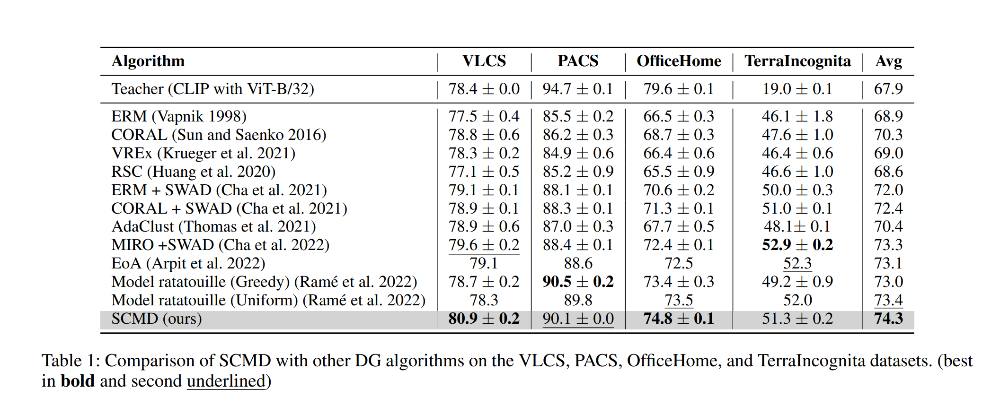

# Welcome to DomainBed

This repo is the implementation of Choosing Wisely and Learning Deeply: Selective Cross-Modality Distillation via CLIP for Domain Generalization.

## Current results


Full results for in DomainBed/sweep/full/big_experiment

### Environments

Environment details used for our study.

```
pip install -r requirements.txt
```


## Quick start
```sh
cd DomainBed
```

Download the datasets:

```sh
python -m domainbed.scripts.download \
       --data_dir=./domainbed/data
```

Train a model:

```sh
python -m domainbed.scripts.train\
       --data_dir='./domainbed/data'\
       --algorithm SCMD\
       --dataset PACS\
       --test_env 3
```

Launch a sweep:

```sh
python -m domainbed.scripts.sweep launch\
       --data_dir=/my/datasets/path\
       --output_dir=/my/sweep/output/path\
       --command_launcher MyLauncher
```

or

```sh
cd DomainBed
bash sweep/full/run.sh
```

* Modify the scripts to your setting
* More details about the scripts are described in [DomainBed](https://github.com/facebookresearch/DomainBed).


To view the results of your sweep:

```sh
python -m domainbed.scripts.collect_results\
       --input_dir=/my/sweep/output/path
```

## Acknowledgements
The codebase is build upon [DomainBed](https://github.com/facebookresearch/DomainBed).